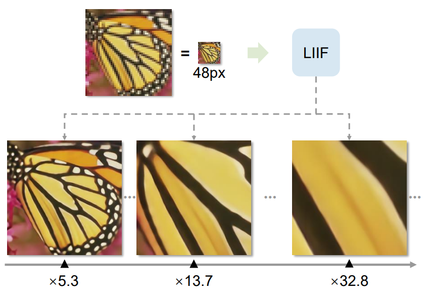

# Learning Continuous Image Representation with Local Implicit Image Function 

## 1. Introduction 

고등학교 때 우리는 함수라는 개념을 배웁니다. 함수는 입력을 넣으면 무언가 값을 반환해주는 거죠. X에 따라서 Y의 값이 바뀌는데, 단순히 다항함수, 지수함수, 삼각함수처럼 고정되고 쉬울 수도 있고, 아니면 그림처럼 무지 복잡할 수도 있습니다. 

이미지를 함수로 생각한다면, (x,y) 좌표에 대해서 RGB 값을 반환하는 함수로 생각할 수 있습니다. 3D 그림으로 나타내면, 다음과 같습니다. 
이 함수는 한눈에 봐도 굉장히 복잡하고, 여기에 맞는 다항함수나 Sine Cosise 함수 조합을 찾는 것도 굉장히 어려워 보입니다. 

|<figure class="image">  <figcaption> 단순한 형태의 함수는 함수식을 유추하기 쉽습니다.    </figcaption> </figure>| <figure class="image">  <figcaption> 이미지처럼 각 픽섹 위치에 대해서 RGB값이 다양한 경우, 위치가 주어졌을 때, R,G,B를 맵핑하는 함수를 찾는 것은 어려습니다.   </figcaption> </figure>| 
|:-:|:-:|

Neural Implicit Representation은 이 함수를 학습시키기 위한 시도입니다. 

한 가지 의문점은 이렇게 함수를 학습시키는 이유가 무엇인가 입니다. 
이미지는 그대로 RGB값을 가지고 있는데, 굳이 함수로 학습시켜야 하는 이유는 다음과 같습니다. 

1. 만일 Neural Network의 파라미터가 이미지 데이터 사이즈 보다 작다면 데이터 압축효과가 있따. 
2. 이미지는 기본적으로 Discrete (Pixel 1, Pixel 2, ...) 인데, 연속적인 함수로 나타내서, 모든 실수에 대한 값을 알 수 있다. 

이러한 이유로 최근에는 Neural Implicit Representation 이 활발히 연구되고 있습니다. 

포스팅에서 소개하는 논문도 CVPR 2021에 출판된 NIR 관련 논문입니다. 기존 NIR과 차이점은 단순히 pixel에 대한 함수를 학습시키는 것이 아니라, discrete한 pixel에 대한 값으로부터 continuous한 좌표에 대한 RGB값을 학습시켰다는 것 입니다. 

## 2. Local Implicit Image Function (LIIF)
픽셀에 대해서 RGB 값을 유추하는 함수는 $s = f_\theta (x)$ 로 나타낼 수 있습니다. 입력으로 원하는 픽셀 위치 $x$ 가 들어오면 출력으로 RGB값 $s$ 를 반환합니다. 여기서 제안한 모델은 Latent코드를 이용하여 Image 에 대한 정보  $M \in \mathbb{R}^{H\times W \times D}$ 가 있을 때, 이를 Continuous image $I$ 로 학습시키는 것을 목적으로 합니다. 
이러한 모델링은 함수를 위치 정보인 x뿐만 아니라, Latent Code에도 의존시킴으로써, 더욱 높은 성능을 얻을 수 있기 때문입니다. 

$$ s = f_\theta (z,x) $$ 

* $s$ : 하나의 픽셀에 대한 RGB 값
* $x$ : Continuous space에서 위치 
* $\theta$ : neural network의 파라미터
* $f$ : neural network 
* $z$ : Latent Code 

Latent Code는 $[0, 2H]\times [0, 2W]$ 이미지가 있을 때, 
$H \times W$ 개의 Latent 코드가 그림처럼 위치마다 있습니다. 

Continuous 한 점 $x$ 에 대해서, 가까운 Latent code가 선택됩니다. 

|<figure class="image">  <figcaption> 전체 8x8 Pixel이 있을 때, Latent Code는 4x4 개가 각 위치별로 고르게 분포되어 있습니다.   </figcaption> </figure>| <figure class="image">  <figcaption> continuous 한 위치 $x$ 에 대해서 $z$* 는 $x$ 에서 가까운 4개의 Latent Code로 정해집니다.  </figcaption> </figure>| 
|:-:|:-:|

최종적으로 Continuous Image의 RGB 값은 다음과 같이 계산됩니다. 

$$
I(x) = \sum_{t \in \{ 00, 01,10,11 \}} \frac{S_t}{S} \cdot f_\theta (z_t^*, x - v_t^*)
$$

* $z_t^*$ : x로부터 가까운 Latent Code (t는 사분면을 나타냅니다)
* $v_t^*$ : 가까운 Latent Code의 좌표
* $S_t$ : $x$ 와 $S_t$ 에 의해서 생성되는 사각형의 넓이
* $S$ :  4가지 사각형 넓이의 합 

## 3. Pipeline 

이 연구에서 목표는 Pixel로 주어진 이미지에 대해서 Continuous 한 성질을 학습시키는 것 입니다. 이를 위해서 두 단계를 거칩니다. 

1. Data Prepartion 단계
2. Training 단계

### 3.1 Data Preparation 
|<figure class="image">  <figcaption> This dog is cut </figcaption> </figure>|
|:-:|

### 3.2 Training

|<figure class="image">  <figcaption> This dog is cut </figcaption> </figure>|
|:-:|

## 4. Additional Engineering 

### 4.1 Feature Unfolding

### 4.2 Cell Decoding 

## 5. Experiments 

## 6. Conclusion 

이 논문에서는 연속적인 이미지 표현을 위한 Local Implicit Image Function을 제안하였습니다. 이 모델의 장점은 Image별로 Latent code를 학습하는 것이 아니라, Latent Code는 다른 Encoder로부터 주어지며, Latent code의 위치를 기반으로 특정 위치까지 떨어진 점 (Continuous)의 RGB 값을 유추하는데 있습니다. 

이러한 방식은 Latent Code를 생성해주는 Encoder의 성능에 영향을 받는다는 한 가지 단점이 있지만, NIR을 위치기반에서 [Latent, 위치] 기반으로 확장한 장점이 있습니다. 

## Related Articles 

[논문에서 사용된 두 가지 Encoder]
* [EDSR]()
* [RDN]()

## References

---

|<figure class="image">  <figcaption> This dog is cut </figcaption> </figure>|
|:-:|

This dog is cute ^_^ 

Inline latex $ax + b$  is working?

$$ 
ax + b  = c\\
cx + d = e
$$ 

> This test comes from other site 

|<figure class="image">  <figcaption> dog 1  </figcaption> </figure>| <figure class="image">  <figcaption> dog2 </figcaption> </figure>| 
|:-:|:-:|

## Awesome...

--- 

* Emojies 😀 😃 😄 😁 😆 😅 😂 🤣 [Here](https://getemoji.com/)
* *Wow* 
* **Wow**

---

## References 
1. SAIL 