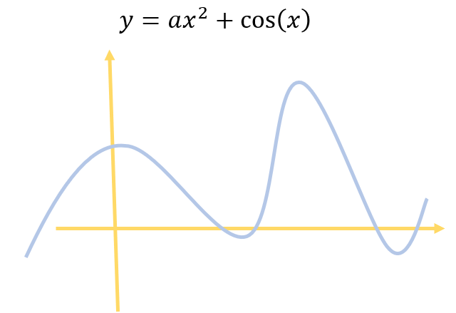
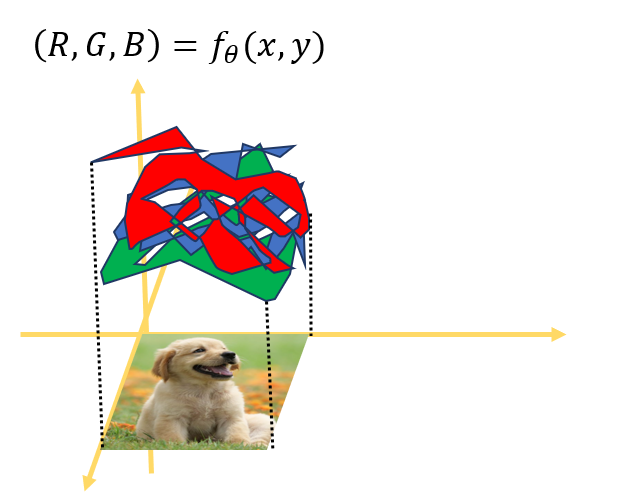
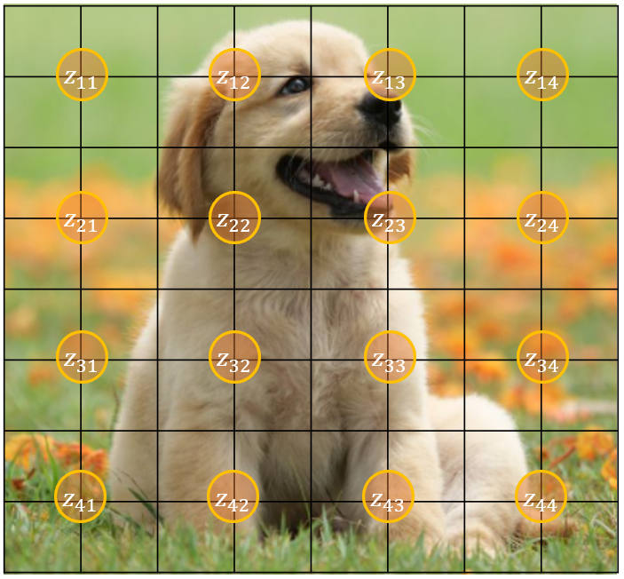
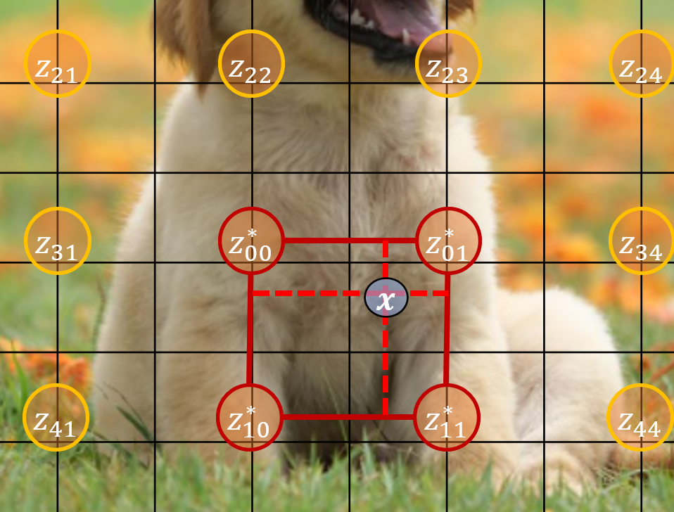
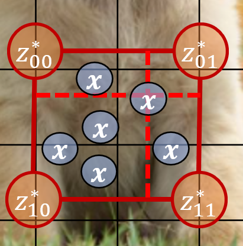
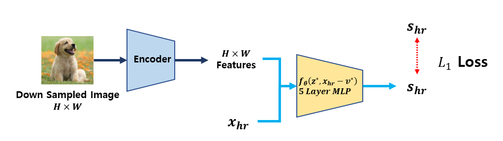
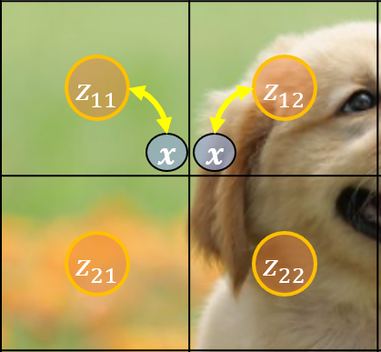
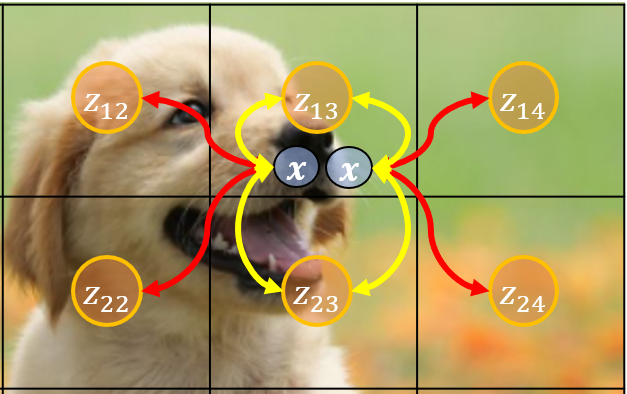
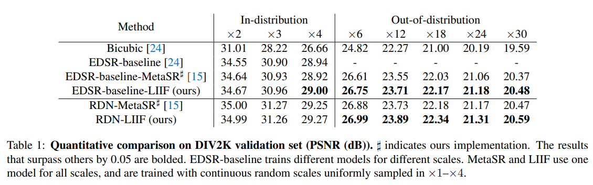
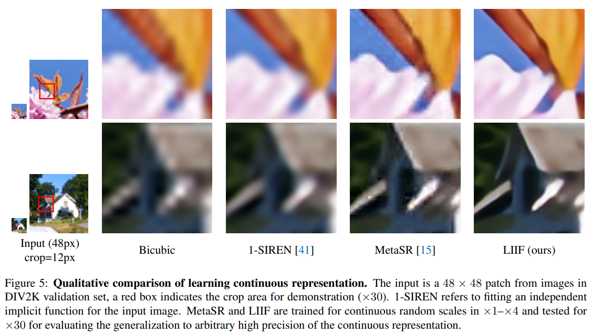

# Learning Continuous Image Representation with Local Implicit Image Function

## 🔖 1. Introduction

### Image as a Function

Image Representation에 대한 기초는 이미지를 함수로 나타내는데서 시작합니다. 함수는 입력을 넣으면 무언가 값을 반환해주는 거죠. $$X$$에 따라서 $$Y$$의 값이 바뀌는데, Figure 1의 다항함수, 지수함수, 삼각함수처럼 쉬울 수도 있고, 아니면 Figure 2 처럼 무지 복잡할 수도 있습니다.

|           Figure 1          |                                  Figure 2                                 |
| :-------------------------: | :-----------------------------------------------------------------------: |
|   |                                                 |
| 단순한 형태의 함수는 함수식을 유추하기 쉽습니다. | 이미지처럼 각 픽섹 위치에 대해서 RGB값이 다양한 경우, 위치가 주어졌을 때, R,G,B를 맵핑하는 함수를 찾는 것은 어려습니다. |

이미지를 함수로 생각한다면, $$(x,y)$$ 좌표에 대해서 RGB 값을 반환하는 함수로 생각할 수 있습니다. 이 함수는 한눈에 봐도 굉장히 복잡하고, 여기에 맞는 다항함수나 $$Sine, Cosise$$ 함수 조합을 찾는 것도 굉장히 어려워 보입니다. 따라서 이미지의 값을 대응시키는 함수를 찾는 것은 결코 쉬운 게 아니고 이를 인공신경망으로 학습하려는 시도가 있었습니다. 이 분야를 **Neural Implicit Represenation (NIR)** 이라고 합니다.

### Why NIR?

NIR은 함수를 학습시키는 것인데, 그 목적은 다음과 같이 2가지로 생각할 수 있습니다.

1. 만일 Neural Network의 파라미터가 이미지 데이터 사이즈 보다 작다면 **데이터 압축효과**가 있다.
2. 이미지는 기본적으로 Discrete (Pixel 1, Pixel 2, ...) 인데, **연속적인 함수**로 나타냄으로써 모든 실수에 대한 값을 알 수 있다. ✨

포스팅에서 소개하는 논문도 CVPR 2021에 출판된 NIR 관련 논문으로 두 번째 목적 ✨ (Continuous Representation)에 대한 논문입니다. 기존 NIR과 차이점은 단순히 pixel에 대한 함수를 학습시키는 것이 아니라, discrete한 pixel에 대한 값으로부터 continuous한 좌표에 대한 RGB값을 학습시켰습니다.

## 🔖 2. Local Implicit Image Function (LIIF)

### Definition

픽셀 $$x$$ 에 대해서 RGB 값을 유추하는 함수는 $$s = f_\theta (x)$$ 로 나타낼 수 있습니다. 모델은 위치정보를 기반으로 RGB값(혹은 Grey scale)을 유추합니다. 여기서 **제안한 모델**은 Latent Code를 이용하여 Image 에 대한 정보 $$M \in \mathbb{R}^{H\times W \times D}$$ 가 있을 때, 이를 Continuous image $$I$$ 로 학습시키는 것을 목적으로 합니다. 이러한 모델링은 함수를 **위치 정보 **$$x$$** 뿐만 아니라, Latent Code에도 의존시킴으로써**, 더욱 높은 성능을 얻을 수 있기 때문입니다. LIIF의 모델은 다음과 같습니다.

$$s = f_\theta (z,x)$$

* $$s$$ : 하나의 픽셀에 대한 RGB 값
* $$x$$ : Continuous space에서 위치
* $$z$$ : Latent Code
* $$f, \theta$$ :neural network , neural network의 파라미터

### Latent Code for continuous position

Latent Code는 $$[0, 2H]\times [0, 2W]$$ 이미지가 있을 때, $$H \times W$$ 개의 Latent Code 가 그림처럼 위치마다 있습니다. Latent Code의 개수는 이미지의 사이즈의 1/4만큼 있으며, 원하는 위치 $$x$$ 가 있을 때, 가까운 Latent code를 선택해주면 됩니다. Figure 4에서는 $$x$$ 위치에 대해서 4 개의 Latent Code를 선택하였는데, 이를 논문에서는 **Local ensemble**이라고 부릅니다. 이를 사용하는 이유는 [4.3](artical\_10.md#42-local-ensemble)에서 다루겠습니다.

|                            Figure 3                           |                                  Figure 4                                  |
| :-----------------------------------------------------------: | :------------------------------------------------------------------------: |
|                                          |                                                       |
| 전체 8x8 Pixel이 있을 때, Latent Code는 4x4 개가 각 위치별로 고르게 분포되어 있습니다. | continuous 한 위치 $$x$$ 에 대해서 $$z^*$$ 는 $$x$$ 에서 가까운 4개의 Latent Code로 정해집니다. |

> 🧐 What is the value of latent code?

Latent code값에 대한 두 가지 의문점을 집고 넘어가겠습니다.

1. _Latent Code값(혹은 초기값)은 무엇인가?_ Pretrained Encoder(EDSR 혹은 RDN)로 이미지를 인코딩한다.
2. _여러 이미지가 있을 때, Latent Code는 공유되는가?_ : (No) Pretrained Model로부터 이미지를 인코딩하기 때문에 이미지마다 Latent Code가 생긴다.
3. _LIIF Training 시 Latent Code는 변하는가?_ (Yes), Freezing 하지 않는다.

### Continuous Representation using Latent Code

이미지에 대한 Latent Code가 고정되어 있으므로 이를 기반으로 Continuous Image의 $$x$$ 좌표에 대한 RGB 값은 Latent Code와 $$x$$ 의 위치 차이를 입력으로 넣어서 계산됩니다.

$$I(x) = \sum_{t \in \{ 00, 01,10,11 \}} \frac{S_t}{S} \cdot f_\theta (z_t^*, x - v_t^*)$$

* $$z_t^*$$ : x로부터 가까운 Latent Code (t는 사분면을 나타냅니다)
* $$v_t^*$$ : 가까운 Latent Code의 좌표
* $$S_t$$ : $$x$$ 와 $$S_t$$ 에 의해서 생성되는 사각형의 넓이
* $$S$$ : 4가지 사각형 넓이의 합

여기서 LIIF 의 장점이 나타납니다. 입력으로 Latent Code와의 거리 차이가 주어지기 때문에, continuous 한 거리 차이를 입력으로 넣게 된다면, 이미지에 대한 continuous representation을 얻게 됩니다. Figure 5에서 나타나듯이, 연속적인 $$x$$를 선택할 수 있습니다. 이를 통해서 모든 $$x$$ 들은 Latent Code의 위치로부터 $$x - v_t^*$$ 값이 계산됩니다.

## 🔖 3. Pipeline

Latent Code와 LIIF 함수의 의미를 살펴봤습니다. 주어진 데이터에 대해서 해당 모델을 학습시키기 위해서 저자는 **Self-Supervised Learning** 방법을 제안하였습니다. 이는 Continuous 한 성질을 학습시키는 것으로 이 두 단계를 거칩니다.

1. Data Preparation 단계
2. Training 단계

### Data Preparation

Data Preparation에서는 Down-sampling된 이미자와 예측할 pixel위치와 RGB값을 준비합니다. Figure 6에 나타나있듯이, 주어진 이미지를 Down-sampling하여 크기를 줄이고 이 정보로부터 사이즈가 큰 원래 이미지의 픽셀에 대한 RGB를 예측합니다. 즉, Higer resolution을 타겟팅하여 학습하고자 합니다.

### Training

학습할 때는 Downsampling된 이미지($$48\times48$$)를 pretrained encoder에 넣어서 feature vector를 뽑아줍니다. 이 값이 Latent Code 역할을 하며, pretrained encoder는 이미지의 사이즈를 그대로 유지해줍니다. Data Preparation 단계에서 얻은 $$x_{hr}$$의 위치에 대한 Pixel값을 LIIF model에 $$x_{hr}$$과 넣어줌으로써, 원하는 RGB값 $$S_{hr}$$을 예측합니다. 이후 실제 값과 $$L1$$ Loss로 계산해주면 학습이 됩니다.

* 인코더의 역할은 이미지 개별에 대한 Latent Code를 뽑아내는 것 입니다. 따라서 다양한 이미지 샘플에 대한 학습이 가능합니다. 기존에 NIR이 이미지 하나에 대해서 Fitting 하는 것과 차이가 있습니다.

> 🧐 이미지에 대해서 더 높은 Resolution을 얻기 위한 Pipeline은 무엇일까?

## 4. Additional Engineering

LIIF 방법에 추가적인 방법들을 통해서 성능을 올릴 수 있습니다. 여기서는 총 3개의 방법이 제안되며, 셋다 사용했을 때, 가장 좋은 성능을 보입니다.

### 4.1 Feature Unfolding

Encoder로부터 나온 Feature (Latent Code)에 대해서, 주변 3x3에 대한 concatenation을 함으로써, 위치에 대한 표현력을 높입니다. 이 경우, input의 dimesion에 대한 size는 9배 증가하게 됩니다.

$$\hat{M}_{jk} = Concat(\{ M_{j+l, k+m} \}_{l,m \in \{-1,0,1\}})$$

### 4.2 Local Ensemble

|         Figure 8        |         Figure 9        |
| :---------------------: | :---------------------: |
|  |  |
|                         |                         |

### 4.3 Cell Decoding

LIIF 모델은 위치에 대한 정보와 근처 Latent Code의 정보를 줍니다. 하지만 우리가 어느 정도의 Resolution을 목표로 하는지 알려주지 못합니다. 예를 들어서, $$48\times 48$$ 에서 $$224 \times 224$$ 로 해상도를 높일 때, 좌표에 대한 정보는 주지만, 우리가 목표로 하는 Decoding Cell의 사이즈를 주지 못합니다. 예시에서는 해당 위치로부터 $2\times2$의 크기를 원한다는 것을 알려줘야 합니다. Cell Decoding을 포함한 LIIF 는 다음과 같습니다.

$$s = f_{cell} (z, [x,c])$$

* $$c = [c_h, c_w]$$

기존 Pixcel값에 Cell 크기를 추가적으로 붙여서 입력으로 넣어줍니다.

## 5. Experiments

### High Resolution benchmark

### Continuous Representation

## 6. Conclusion

이 논문에서는 연속적인 이미지 표현을 위한 Local Implicit Image Function을 제안하였습니다. 이 모델의 장점은 Image별로 Latent code를 학습하는 것이 아니라, Latent Code는 다른 Encoder로부터 주어지며, Latent code의 위치를 기반으로 특정 위치까지 떨어진 점 (Continuous)의 RGB 값을 유추하는데 있습니다.

이러한 방식은 Latent Code를 생성해주는 Encoder의 성능에 영향을 받는다는 한 가지 단점이 있지만, NIR을 위치기반에서 \[Latent, 위치] 기반으로 확장한 장점이 있습니다.

## Related Articles

\[논문에서 사용된 두 가지 Encoder]

* [EDSR](artical\_10.md)
* [RDN](artical\_10.md)

## References
