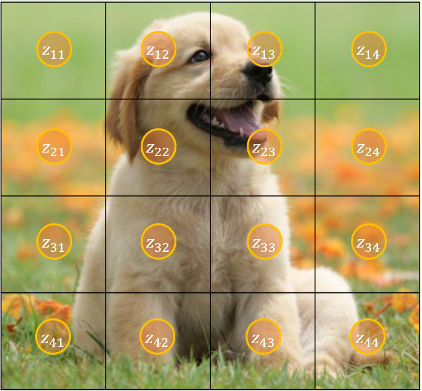
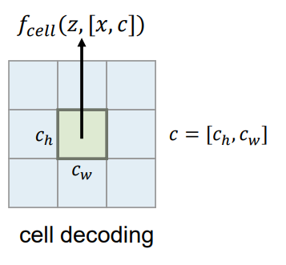

# Learning Continuous Image Representation with Local Implicit Image Function 

## 🔖 1. Introduction

### Image as a Function 

Image Representation에 대한 기초는 이미지를 함수로 나타내는데서 시작합니다.  함수는 입력을 넣으면 무언가 값을 반환해주는 거죠. $$X$$에 따라서 $$Y$$의 값이 바뀌는데, Figure 1의 다항함수, 지수함수, 삼각함수처럼 쉬울 수도 있고, 아니면 Figure 2 처럼 무지 복잡할 수도 있습니다.

|Figure 1|Figure 2|
|:-:|:-:|
|<figure class="image">  <figcaption>   </figcaption> </figure>| <figure class="image">  <figcaption>   </figcaption> </figure>| 
| 단순한 형태의 함수는 함수식을 유추하기 쉽습니다. |이미지처럼 각 픽섹 위치에 대해서 RGB값이 다양한 경우, 위치가 주어졌을 때, R,G,B를 맵핑하는 함수를 찾는 것은 어려습니다. 

이미지를 함수로 생각한다면, $$(x,y)$$ 좌표에 대해서 RGB 값을 반환하는 함수로 생각할 수 있습니다.  이 함수는 한눈에 봐도 굉장히 복잡하고, 여기에 맞는 다항함수나 $$Sine, Cosise$$ 함수 조합을 찾는 것도 굉장히 어려워 보입니다. 따라서 이미지의 값을 대응시키는 함수를 찾는 것은 결코 쉬운 게 아니고 이를 인공신경망으로 학습하려는 시도가 있었습니다. 이 분야를 **Neural Implicit Represenation (NIR)** 이라고 합니다. 

### Why NIR?

NIR은 함수를 학습시키는 것인데, 그 목적은 다음과 같이 2가지로 생각할 수 있습니다. 

1. 만일 Neural Network의 파라미터가 이미지 데이터 사이즈 보다 작다면 **데이터 압축효과**가 있다. 
2. 이미지는 기본적으로 Discrete (Pixel 1, Pixel 2, ...) 인데, **연속적인 함수**로 나타냄으로써 모든 실수에 대한 값을 알 수 있다. ✨

포스팅에서 소개하는 논문도 CVPR 2021에 출판된 NIR 관련 논문으로 두 번째 목적 ✨ (Continuous Representation)에 대한 논문입니다. 기존 NIR과 차이점은 단순히 pixel에 대한 함수를 학습시키는 것이 아니라, discrete한 pixel에 대한 값으로부터 continuous한 좌표에 대한 RGB값을 학습시켰습니다.  

## 🔖 2. Local Implicit Image Function (LIIF)

### Definition
픽셀 $$x$$ 에 대해서 RGB 값을 유추하는 함수는 $$s = f_\theta (x)$$ 로 나타낼 수 있습니다. 모델은 위치정보를 기반으로 RGB값(혹은 Grey scale)을 유추합니다. 
 여기서 **제안한 모델**은 Latent Code를 이용하여 Image 에 대한 정보  $$M \in \mathbb{R}^{H\times W \times D}$$ 가 있을 때, 이를 Continuous image $$I$$ 로 학습시키는 것을 목적으로 합니다. 이러한 모델링은 함수를 **위치 정보 $$x$$ 뿐만 아니라, Latent Code에도 의존시킴으로써**, 더욱 높은 성능을 얻을 수 있기 때문입니다. LIIF의 모델은 다음과 같습니다. 

$$ s = f_\theta (z,x) $$ 

- $$s$$ : 하나의 픽셀에 대한 RGB 값
- $$x$$ : Continuous space에서 위치 
- $$z$$ : Latent Code 
- $$f, \theta$$ :neural network ,  neural network의 파라미터

### Latent Code for continuous position

Latent Code는 $$[0, 2H]\times [0, 2W]$$ 이미지가 있을 때,  $$H \times W$$ 개의 Latent Code 가 그림처럼 위치마다 있습니다. Latent Code의 개수는 이미지의 사이즈의 1/4만큼 있으며, 원하는 위치 $$x$$ 가 있을 때,  가까운 Latent code를 선택해주면 됩니다. Figure 4에서는 $$x$$ 위치에 대해서 4 개의 Latent Code를 선택하였는데, 이를 논문에서는 **Local ensemble**이라고 부릅니다. 이를 사용하는 이유는 [4.3](#42-local-ensemble)에서 다루겠습니다. 

> 🧐 What is the value of latent code?

    Latent code값에 대한 두 가지 의문점을 집고 넘어가겠습니다. 
    1. Latent Code값(혹은 초기값)은 무엇인가? Pretrained Encoder(EDSR 혹은 RDN)로 이미지를 인코딩한다. 따라서 **이미지마다 Latent Code는 다르게** 됩니다. 
    2. LIIF Training 시 Latent Code는 변하는가? (Yes)

|Figure 3|Figure 4|
|:-:|:-:|
|<figure class="image">   </figure>| <figure class="image">   </figure>| 
|전체 8x8 Pixel이 있을 때, Latent Code는 4x4 개가 각 위치별로 고르게 분포되어 있습니다. |continuous 한 위치 $$x$$ 에 대해서 $$z^*$$ 는 $$x$$ 에서 가까운 4개의 Latent Code로 정해집니다.|

### Continuous Representation using Latent Code

Latent Code를 기반으로 Continuous Image의 RGB 값은 다음과 같이 계산됩니다. 

$$I(x) = \sum_{t \in \{ 00, 01,10,11 \}} \frac{S_t}{S} \cdot f_\theta (z_t^*, x - v_t^*)$$

- $$z_t^*$$ : x로부터 가까운 Latent Code (t는 사분면을 나타냅니다)
- $$v_t^*$$ : 가까운 Latent Code의 좌표
- $$S_t$$ : $$x$$ 와 $$S_t$$ 에 의해서 생성되는 사각형의 넓이
- $$S$$ :  4가지 사각형 넓이의 합 

## 🔖 3. Pipeline 

이 연구에서 목표는 Pixel로 주어진 이미지에 대해서 Continuous 한 성질을 학습시키는 것 입니다. 이를 위해서 두 단계를 거칩니다. 

1. Data Prepartion 단계
2. Training 단계

### 3.1 Data Preparation 

|Figure 4 Data Preparation|
|:-:|
|<figure class="image">  </figure>|
|This dog is cut|

### 3.2 Training

|Figure 5 Training Image|
|:-:|
|<figure class="image">  </figure>|
|This dog is cut |

## 4. Additional Engineering 

### 4.1 Feature Unfolding

### 4.2 Local Ensemble 

### 4.3 Cell Decoding 

## 5. Experiments 

## 6. Conclusion 

이 논문에서는 연속적인 이미지 표현을 위한 Local Implicit Image Function을 제안하였습니다. 이 모델의 장점은 Image별로 Latent code를 학습하는 것이 아니라, Latent Code는 다른 Encoder로부터 주어지며, Latent code의 위치를 기반으로 특정 위치까지 떨어진 점 (Continuous)의 RGB 값을 유추하는데 있습니다. 

이러한 방식은 Latent Code를 생성해주는 Encoder의 성능에 영향을 받는다는 한 가지 단점이 있지만, NIR을 위치기반에서 [Latent, 위치] 기반으로 확장한 장점이 있습니다. 

## Related Articles 

[논문에서 사용된 두 가지 Encoder]
* [EDSR]()
* [RDN]()

## References

---

|<figure class="image">  <figcaption> This dog is cut </figcaption> </figure>|
|:-:|

This dog is cute ^_^ 

Inline latex $ax + b$  is working?

$$ 
ax + b  = c\\
cx + d = e
$$ 

> This test comes from other site 

|<figure class="image">  <figcaption> dog 1  </figcaption> </figure>| <figure class="image">  <figcaption> dog2 </figcaption> </figure>| 
|:-:|:-:|

## Awesome...

--- 

* Emojies 😀 😃 😄 😁 😆 😅 😂 🤣 [Here](https://getemoji.com/)
* *Wow* 
* **Wow**

---

## References 
1. SAIL 