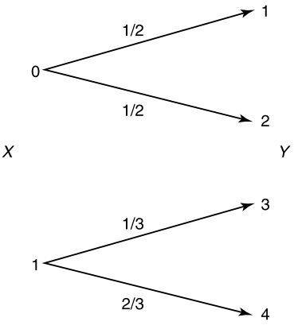

# Channel Capacity

## :page\_facing\_up:Channel

We want to send a message via a channel. But it is not perfect and the signal is not perfect.&#x20;

Mathematically, the channel transmission is written by&#x20;

* Channel: $$p(y|x)$$
* Message $$W$$ ->  $$X^n = Encoder(W)$$
* Estimate of Message $$\hat{W} = Decoder(Y^n)$$


Data compression and data transmission

1. Data compression: we **remove **all the redundancy in the data to form the most compressed version possible.&#x20;
2. Data transmission: we **add **redundancy in a controlled fashion to combat errors in the channel.&#x20;


#### 1) Examples of channel capacity: Noiseless Binary Channel&#x20;

The transmitted bit is received without error.  The capacity $$C= 1$$​

$$
\begin{aligned}
C &= \max I(X;Y) \\
&= \max H(Y) - H(Y|X) \\
&= \log 2 - 0 \\
& = 1

\end{aligned}
$$

#### 2) Examples of channel capacity: Noisy Channel with non-overlapping outputs&#x20;

Even though, there is a random output for the given input, we can always, reconstruct the input from the output, therefore, it is same with the noiseless Binary Channel.&#x20;

#### 3) Examples of channel capacity: Binary Symmetric Channel

For the input, we have a probability $$\epsilon$$ of flipping the input.&#x20;

$$
\begin{aligned}
I(X;Y) &= H(Y) - H(Y|X) \\
&= H(Y) - \sum_x p(x) H(p)  \\
&\le 1 - H(p)

\end{aligned}
$$


Note that, when the mutual information between inputs and outputs increases, the capacity also increases. Therefore,&#x20;

an operational definition of channel capacity as **the highest rate in bits per channel use **at which information can be sent with arbitrarily low probability of error.&#x20;

&#x20;:star::star::star:Therefore, we can send maximally :star::star::star:

* 1 bits in noiseless&#x20;
* $$1-H(P)$$ bits for **BSC per channel use**&#x20;

This can be interpreted as the number of distinguishable signals  for a bit in $$X^n$$​


## ​:page\_facing\_up: Operational meaning of Capacity&#x20;

1. Total number of possible (typical) $$Y$$ sequences is $$\approx 2^{nH(Y)}$$
2. $$Y^n$$ has to be divided into sets of size $$2^{nH(Y|X)}$$corresponding to the different input $$X$$.&#x20;
3. The total number of disjoint sets is less than or equal to $$2^{n(H(Y) - H(Y|X)}$$

**Therefore, we can send at most **$$\approx 2^{nI(X;Y)}$$**distinguishable sequences of length **$$n$$**.**

.png>)

