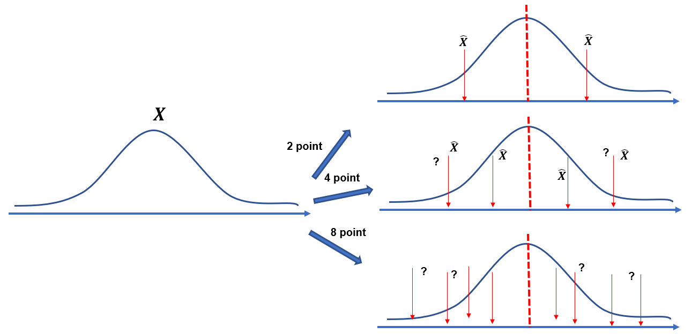

# \[1.3] Rate Distortion Theorem

When we want to represent continuous random variable with finite number of bits, we should design the mapping function so that the description achieves the minimum distortion. When have a continuous representation $$X$$ and want to describe it with finite $$\hat X$$.&#x20;


**Definition (distortion function)**

$$d : \mathcal{X} \times \mathcal{\hat X} \rightarrow \mathbb{R}^+$$denotes a distortion function. We define the corresponding distortion between two sequences $$x^n$$ and $$\hat x^n$$ as  $$d^{(n)}(x^n, \hat x^n) = \frac{1}{n} \sum_{i=1}^n d(x_i, \hat x_i)$$​

This is the empirical average of distortion between the two sequences.


#### example 1 (Hamming distortion)

$$
d(x, \hat x ) = \begin{cases}
0 & \text{if } x = \hat x \\1 &\text{if } x \ne \hat x 
\end{cases}
$$

It is also, the probability of error distortion, since $$\mathbb{E}[d(X,\hat X)] = Pr(X \ne \hat X)$$

#### example 2 (Squared-error distortion)

$$
d(x, \hat x ) = (x- \hat x ) ^2
$$

​It is highly related to the mean squared error, but not a good metric for the human evaluation because most waveform includes small noise errors. (similar with image data)


**Definition (The distortion associated** $$(2^{nR},n)$$**-rate distortion code)**

$$D=\mathbb{E}(d(X^n, g_n(f_n(X^n)))$$​

$$D=\sum_{x^n} p(x^n)(d(x^n, g_n(f_n(x^n)))$$​

Here $$g_n(m) = \hat{X}^n(m)$$ is a codeword and $$f_n^{-1}(m)$$ is the **associated region**



**Definition (achievable rate-distortion pair)**&#x20;

A rate distortion pair $$(R,D)$$ is achievable if and only if there exists a sequence of $$(2^{nR}, n)$$-rate distortion codes $$(f_n, g_n)$$such that$$\lim_{n\rightarrow \infty} \mathbb{E}[d^{(n)} (X^n, g_n(f_n(X^n)))] \le D$$​

* **The rate distortion region for a source** : the closure of the set of achievable rate distortion region of the source for a given distortion $$D$$.
*   **The rate distortion function** $$R(D) = \inf\{R:(R,D) \text{~is achievable}\}$$ **for a given** $$D$$

    :star:(주어진 D를 만족하는 최소한의 rate R)​
* **​The distortion rate function**  $$D(R)= \inf\{D: (R,D) \text{ is achievable}\}$$for a given $$R$$​



**Theorem (Rate Distortion Theorem)**

For a given $$DMS(P_X)$$ and a distortion function $$d$$, and fixed $$D$$, $$R(D) = R^{(I)} (D)$$

That is, ​ $$\inf\{R:(R,D) \text{~is achievable}\}= \min_{\{P_{Y|X}: \mathbb{E}_{P_{XY}}[d(X,Y)] \le D\}} I(P_X, P_{Y|X})$$**​**

* **\[**:ballot\_box\_with\_check:**] :** $$\lim_{n\rightarrow \infty} \mathbb{E}[d^{(n)} [(X^n, Y^n) ] \le D$$​&#x20;
* Sufficient -> $$\exists (n,R)$$ codes $$R > R^{(I)}(D)$$ -> satisfy **\[**:ballot\_box\_with\_check:**]**
*   Necessary -> $$R < R^{(I)}(D)$$ -> never satisfy **\[**:ballot\_box\_with\_check:**]**

    ****

    **-----**
*   **Achievability:**&#x20;

    $$R> I(P_X, P_{Y|X})$$-> the error goes to zero (**(R,D)** is achievable)
*   **Converse**

    :star::star:&#x20;

    &#x20;$$R < R^{(I)}(D)$$ -> never satisfy  is equal to (satisfy -> $$R \ge R^{(I)}(D)$$)

    :star::star:&#x20;

    R < I(P\_x, P\_y|x) -> the error never goes to zero it is not achievable.&#x20;

    When distortion $$E[d(X^n, \hat X^n)] \ge D$$, then always $$R\ge R(D)$$

    This means, the ratio exceeds the $$R(D)$$






