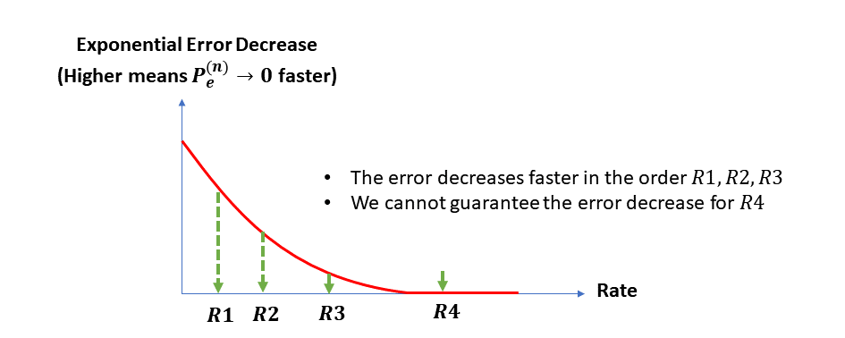
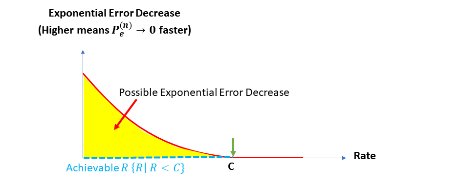

# Channel Coding Theorem

In this page, we'll study the channel coding theorem.

> **Thm. (Channel Coding Theorem)** The maximum achievable rate $$R$$ is $$C= \max_{P_X} I(P_X , W)$$. To be precise, if $$R< C$$, then $$R$$ is achievable, and if $$R>C$$, then it is not achievable.

### What is given?



* The fixed length of n
* The channel W = p\_{Y|X}
* The channel capacity C = max_{p|X} I(P_\_X, W)&#x20;



#### Background&#x20;

* What is (n, R) codes
* Fanno's inequality
* Data processing inequality&#x20;















### :pen\_fountain: What is the meaning of achievable?

$$R$$ is achievable means that the error probability goes to zero with the rate $$R$$.

We are given, fixed $$(n, R)$$ codes.

$$
P_{e,m}^{(n)} = \text{Pr}(g_n(y^n)) \ne m| x^n(m))
$$

and the maximum error probability is&#x20;

$$P_{e, \text{max}}^{(n)} = \max_m P_{e,m}^{(n)}$$&#x20;

We say a rate $$R$$ is achievable if there exists, a sequence of $$(n, R)$$ codes such that $$P_{e, \text{max}}^{(n)} \rightarrow 0$$

Therefore with _achievable rate_, we can construct $$(n, R)$$ codes such that the maximum error goes to zero as $$n$$ goes to the infinity.

#### \[Proof] When R > C,  there is no (n,R) code such that $$P_{e, \text{max}}^{(n)} \rightarrow 0$$

$$
\begin{aligned} nR = H(M) &= H(M|Y^n) + I(M;Y^n)\\ &= H(M|Y^n) + I(X^n(M); Y^n) ~~ \text{data processing inequality}\\ &= \log{2} + P_e^{(n)} nR + I(X^n(M);Y^n) ~~ \text{Fano's inequality}\\ &= \log{2} + P_e^{(n)}nR + nC ~~\text{By the definition of } C \end{aligned}
$$

Therefore we have,

$$
P_n^{(n)} \ge 1- \frac{C}{R} - \frac{1}{nR}
$$

When $$R<C$$, the right hand side is bounded away from 0** (good)**

When $$R>C$$, the right hand is is always positive, and the error never goes to $$0$$.&#x20;



The entropy of the message is the uncertainty among  $$2^{nR}$$ codes.&#x20;

Because it is uniformly distributed, we have&#x20;

$$H(M) = -\sum \frac{1}{2^{nR}} \log \frac{1}{2^{nR}} =  \log{2^{nR}} = nR$$&#x20;







### :white\_check\_mark: Meaning of the Channel Coding Theorem

**You can contact me via**

* bumjin@kaist.ac.kr&#x20;
* [https://open.kakao.com/me/fxnnxc](https://open.kakao.com/me/fxnnxc)

